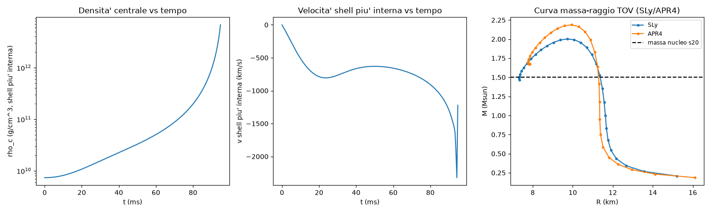

# Simulazione numerica del collasso gravitazionale stellare

Simulazione a simmetria sferica del collasso di nuclei stellari pre-supernova, inizializzata da parametri di stelle reali, con output sia numerico sia visivo.

## Indice

- [Obiettivo](#obiettivo)
- [Vincoli fisici e approssimazioni dichiarate](#vincoli-fisici-e-approssimazioni-dichiarate)
- [Catalogo dei progenitori](#catalogo-dei-progenitori)
- [Struttura del repository](#struttura-del-repository)
- [Installazione](#installazione)
- [Come eseguire la simulazione](#come-eseguire-la-simulazione)
- [Esempio di output](#esempio-di-output)
- [Script demo storici](#script-demo-storici)
- [Test](#test)
- [Validazione](#validazione)
- [Rigore metodologico: come il progetto ha trattato i propri errori](#rigore-metodologico-come-il-progetto-ha-trattato-i-propri-errori)
- [Riferimenti bibliografici](#riferimenti-bibliografici)
- [Licenza](#licenza)

## Obiettivo

Simulazione a simmetria sferica del collasso di una stella, inizializzata da parametri di stelle reali (catalogo progenitori), con output sia numerico (velocità, tempi scala, energie, classificazione del remnant) sia visivo (animazione dell'evoluzione).

Il codice compone in un'unica pipeline: il profilo di equilibrio iniziale del nucleo (equazione di Lane-Emden), la pressione di degenerazione elettronica (EOS esatta di Chandrasekhar), la dinamica del collasso (shell Lagrangiane con correzione gravitazionale relativistica approssimata), e la classificazione del remnant finale (limite di Oppenheimer-Volkoff con EOS nucleari realistiche SLy/APR4).

## Vincoli fisici e approssimazioni dichiarate

| Vincolo | Come è implementato |
|---|---|
| Profilo di equilibrio iniziale | Equazione di Lane-Emden (politropica), `collasso/lane_emden.py` |
| Pressione di degenerazione | EOS esatta di Chandrasekhar (non-rel. → ultra-rel.), `collasso/eos.py` |
| Soglia di instabilità | Massa di Chandrasekhar (~1.4 M☉ per Ye=0.495) |
| Dinamica del collasso | Shell Lagrangiane, simmetria sferica, `collasso/dynamics.py` |
| Gravità | Newtoniana, con correzione relativistica approssimata "Case A" sul nucleo (`collasso/relativistic.py`) |
| Classificazione remnant | Limite TOV con EOS nucleare realistica a politropi a tratti (SLy/APR4, Read et al. 2009), `collasso/tov.py` |
| Rotazione / campo magnetico | Trascurati — limite dichiarato |
| Validazione | Confronto qualitativo con GR1D e letteratura, vedi [VALIDATION.md](VALIDATION.md) |

Due limiti meritano una spiegazione più diretta, perché condizionano l'interpretazione di ogni risultato:

**Trasporto di neutrini.** Nel codice attuale non è un termine "semplificato" attivo, è un'**assenza totale**: nessuna funzione del progetto calcola una perdita di energia per neutrini. Il disclaimer stampato ad ogni esecuzione (`collasso/pipeline.py::_build_disclaimers`) lo dichiara esplicitamente:

> "Nessun trasporto di neutrini: il progetto usa solo un termine di raffreddamento neutrini semplificato/assente ... l'energia persa per neutrini non è inclusa nel bilancio energetico."

**Assenza di un vero bounce fisico.** Il modello non può produrre un bounce per costruzione: la pressione di degenerazione è sempre calcolata con l'EOS di Chandrasekhar per elettroni degeneri (`collasso/eos.py`), che non si irrigidisce mai a densità nucleare — anzi si ammorbidisce (Γ: 5/3 → 4/3) al crescere della densità. Non esiste quindi, in questo modello, alcun meccanismo che produca un'onda d'urto di rimbalzo. L'evento che termina la dinamica (`t_collapse_s`, `collasso/dynamics.py`) è una soglia numerica — raggio minimo raggiunto, incrocio di shell, o prossimità al raggio di Schwarzschild — non un vero bounce. I confronti con la letteratura/GR1D in [VALIDATION.md](VALIDATION.md) restano quindi qualitativi e limitati all'ordine di grandezza dei tempi scala, mai una validazione quantitativa di un tempo di bounce.

## Catalogo dei progenitori

`data/progenitors_reference.csv` contiene 6 progenitori reali più una voce proxy dichiarata, tutti dalla stessa fonte (O'Connor & Ott 2011, ApJ 730:70, Tabella 1 pag. 5 — dati Woosley, Heger & Weaver 2002). Per ogni stella, **massa del nucleo e Ye sono dati di letteratura citati**; densità centrale è scelta come valore fisico plausibile (non letteratura); indice politropico e raggio iniziale sono **derivati internamente** dal progetto stesso (`collasso.eos.n_eff_chandrasekhar` + `collasso.lane_emden`), non presi da letteratura — vedi il campo `fonte` di ogni riga del CSV per il dettaglio completo per campo.

| id | massa ZAMS (M☉) | massa nucleo (M☉) | Ye | massa/M_Ch | scarto K |
|---|---|---|---|---|---|
| `s15` | 15 | 1.55 | 0.495 | 108.6% | +6.73% |
| `s20` | 20 | 1.46 | 0.495 | 102.3% | +2.32% |
| `s25` | 25 | 1.62 | 0.495 | 113.5% | +9.52% |
| `s30` | 30 | 1.46 | 0.495 | 102.3% | +2.10% |
| `s35` | 35 | 1.49 | 0.495 | 104.4% | +3.43% |
| `s40` | 40 | 1.56 | 0.495 | 109.3% | +6.59% |
| `betelgeuse` | 20 (proxy) | 1.46 | 0.495 | 102.3% | +2.32% |

M_Chandrasekhar(Ye=0.495) = 1.4270 M☉, identica per tutte le stelle (Ye fisso, definizione di O'Connor & Ott 2011). "Scarto K" (`collasso.eos.chandrasekhar_k_deviation_pct`) è la misura di quanto ogni profilo si discosti da un vero equilibrio idrostatico con l'EOS esatta — tutti i nuclei sono sopra M_Chandrasekhar per costruzione (nessun equilibrio esiste a nessuna densità centrale per queste masse), quindi lo scarto è sempre positivo: cresce con quanto ciascun nucleo è supra-Chandrasekhar. Vedi [VALIDATION.md](VALIDATION.md), sezione "Scarto K", per la dimostrazione quantitativa completa.

**`betelgeuse` è un proxy dichiarato, non un modello calcolato per Betelgeuse specificamente.** Riusa esattamente i valori di `s20` (stesso modello WHW02, ZAMS=20 M☉) perché nessuna delle 7 masse ZAMS disponibili nella Tabella 1 di O'Connor & Ott (15/20/25/30/35/40/75) è più vicina alla stima reale della massa iniziale di Betelgeuse: **18–21 M☉** (Joyce, Leung, Molnár, Ireland, Kobayashi & Nomoto 2020, ApJ 902, 63) e **~19 M☉** (Saio, Kondo, Ekström, Meynet & Georgy 2023, MNRAS 526, 2765, arXiv:2306.00287). L'etichettatura proxy compare esplicitamente sia nel CSV (colonna `nota_proxy`) sia nell'output di `run_simulation.py` (un nono disclaimer condizionale, oltre agli 8 standard, con parola chiave "proxy") — non è presentata come una ricostruzione della struttura interna specifica della stella.

## Struttura del repository

```
collasso/
├── catalog.py                  Catalogo progenitori (dataclass Progenitor, caricamento CSV)
├── constants.py                Costanti fisiche (CODATA 2018 / IAU 2015)
├── lane_emden.py                Solver equazione di Lane-Emden (equilibrio iniziale)
├── eos.py                       EOS di Chandrasekhar per elettroni degeneri (esatta)
├── eos_neutron.py                EOS storica/didattica a neutroni liberi (caso limite, Oppenheimer & Volkoff 1939)
├── eos_piecewise_polytrope.py    EOS realistiche SLy/APR4 (Read, Lackey, Owen & Friedman 2009)
├── dynamics.py                   Dinamica shell Lagrangiane (RK45, eventi terminali)
├── relativistic.py               Correzione gravitazionale relativistica approssimata "Case A"
├── tov.py                        Integrazione equazione TOV, limite di Oppenheimer-Volkoff
├── remnant.py                    Classificazione remnant (white_dwarf / neutron_star / black_hole)
├── pipeline.py                   Orchestrazione pura (run_full_simulation), nessun I/O
└── visualization.py               Animazioni GIF (a linea + disco 2D per densita') + grafico riassuntivo PNG

scripts/
├── run_simulation.py            ENTRY POINT UNICO — simulazione completa, numerico + visivo
└── step1_demo.py ... step6_demo.py   Demo storiche, una per fase di sviluppo (vedi sotto)

data/
└── progenitors_reference.csv    Catalogo: 6 stelle + 1 proxy, massa nucleo e Ye da letteratura reale

tests/                           105 test, un file per modulo
docs/img/                        Immagini di esempio per questo README

STATUS.md          Log dettagliato di ogni ciclo di sviluppo
VALIDATION.md       Confronto qualitativo con GR1D e letteratura
CLAUDE.md           Regole e vincoli fisici non negoziabili del progetto
LICENSE             MIT
```

## Installazione

Richiede Python 3.12 (o compatibile).

```bash
python -m venv .venv
source .venv/Scripts/activate   # Windows (Git Bash); su Linux/Mac: source .venv/bin/activate
pip install -r requirements.txt
```

Dipendenze: `numpy`, `scipy`, `matplotlib`, `pytest`, `rich` (formattazione dell'output da terminale).

## Come eseguire la simulazione

```bash
python scripts/run_simulation.py <star_id>
```

dove `<star_id>` è uno tra `s15`, `s20`, `s25`, `s30`, `s35`, `s40`, `betelgeuse` (vedi [Catalogo dei progenitori](#catalogo-dei-progenitori) — `betelgeuse` è un proxy dichiarato, non un modello dedicato). Senza argomenti, lo script chiede interattivamente quale stella simulare.

Ogni esecuzione produce **sia** l'output numerico completo **sia** una visualizzazione:

- **A stdout** (formattato con `rich`: pannelli, tabelle, colori): profilo di equilibrio iniziale, dinamica del collasso (tempo e causa dell'evento terminale), bilancio energetico, massa di Chandrasekhar, limite TOV per SLy e APR4, classificazione del remnant, e gli 8 limiti del modello (9 per `betelgeuse`, sempre stampati, mai omessi).
- **Su disco** (cartella `output/`, creata automaticamente), tre file:
  - `collapse_<star_id>.gif` — animazione a linea (raggio di ogni shell vs frazione di massa racchiusa).
  - `collapse_disk_<star_id>.gif` — animazione **alternativa**: la stella disegnata come un disco 2D pieno, colorato per densità locale di shell (scala log), che si restringe nel tempo — pensata per dare l'impressione visiva di una stella che collassa, non di un grafico a linea. L'ultimo fotogramma dichiara esplicitamente, in sovrimpressione, che la simulazione termina lì e che nessun bounce è modellato.
  - `summary_<star_id>.png` — grafico a 3 pannelli: densità centrale vs tempo, velocità della shell più interna vs tempo, curva massa-raggio TOV con la massa del nucleo marcata.

## Esempio di output



Estratto reale (non l'intero output) da `python scripts/run_simulation.py s20`:

```
--- Stella (catalogo di riferimento, Step 1) ---
id=s20, massa_zams_msun=20.00, massa_nucleo_msun=1.4600, ye=0.49, n_politropico=2.98
fonte: massa/ye: O'Connor & Ott 2011 ApJ 730:70 Tabella 1 pag.5 (s20WHW02; dati WHW02 2002) ...

--- Profilo di equilibrio iniziale (Lane-Emden, Step 2) ---
Scarto K (costante politropica implicita vs. EOS di Chandrasekhar esatta alla stessa densita' centrale): +2.32% - misura diretta di quanto questo nucleo sia supra-Chandrasekhar (NON un errore di modellazione, vedi disclaimer 2 sotto).

--- Dinamica del collasso (shell Lagrangiane, Step 4/5, relativistic=True) ---
collapsed=True, collapse_reason=r_min_threshold, t_collapse_s=0.26739670570478513

--- Classificazione del remnant (Step 6/Retrofit) ---
M_Chandrasekhar(ye=0.495)=1.4270 Msun (Newtoniana classica, Step 3)
SLy:  M_TOV=2.0020 Msun -> classificazione='neutron_star'
APR4: M_TOV=2.1872 Msun -> classificazione='neutron_star'
```

Lo scarto K (`k_deviation_pct`) è sempre presente nell'output completo, sezione "Profilo di equilibrio iniziale" — l'estratto qui sopra è parziale per brevità, ma questa riga specifica non è mai omessa in un'esecuzione reale.

## Script demo storici

Oltre all'entry point unico, `scripts/` contiene sei script demo storici, uno per ogni fase di sviluppo del progetto — ancora funzionanti, non duplicano `run_simulation.py`: mostrano un singolo modulo isolato, non la pipeline completa.

| Script | Cosa dimostra |
|---|---|
| `step1_demo.py` | Catalogo progenitori |
| `step2_demo.py` | Solver Lane-Emden vs soluzioni analitiche note |
| `step3_demo.py` | EOS di Chandrasekhar, massa di Chandrasekhar |
| `step4_demo.py` | Dinamica shell Lagrangiane |
| `step5_demo.py` | Correzione relativistica "Case A" |
| `step6_demo.py` | TOV, EOS SLy/APR4, classificazione remnant |

## Test

```bash
pytest -q
```

105 test, un file per modulo (`tests/test_<modulo>.py`), copertura completa di ogni componente fisico e dell'orchestrazione (incluso il catalogo esteso a 6 stelle, la voce proxy `betelgeuse`, e le due animazioni di `collasso.visualization`).

## Validazione

[VALIDATION.md](VALIDATION.md) confronta i risultati del progetto con il comportamento noto/pubblicato del codice GR1D (O'Connor & Ott 2010/2011) e con la letteratura di riferimento — non un'esecuzione letterale di GR1D (fuori portata come dipendenza esterna), ma un confronto qualitativo su tempi scala, massa critica, classificazione del remnant, e un controllo esplicito di quanto ogni profilo iniziale si discosti da un vero equilibrio idrostatico (nuclei tutti supra-Chandrasekhar per costruzione — è la ragione fisica per cui collassano).

## Rigore metodologico: come il progetto ha trattato i propri errori

Durante la validazione (Step 8), un pattern non monotono nella velocità della shell più interna di s20 era stato classificato come **"FISICO, non artefatto numerico"**, sulla base di un test di convergenza in N (100→1600 shell) che mostrava convergenza <0.1%.

Dopo un successivo aggiornamento del catalogo con masse reali (da placeholder a dati di letteratura), quel pattern è sparito. Invece di lasciar perdere, il progetto ha verificato esplicitamente *perché*: un'ipotesi precisa — un test di convergenza in N a parità di condizione iniziale può rivelare **solo** errore di discretizzazione, non l'incoerenza fisica della condizione iniziale stessa (il vecchio profilo placeholder aveva un indice politropico `n=2.0` scelto arbitrariamente, non derivato dalla EOS, con un mismatch di Lane-Emden di 6.33× fra il raggio dichiarato e quello consistente con la massa dichiarata).

L'esperimento decisivo: tenendo identici densità centrale, Ye e massa (quindi lo stesso rapporto massa/M_Chandrasekhar del vecchio caso, 121.7%), e cambiando **solo** l'indice politropico da 2.0 arbitrario a quello derivato dalla EOS esatta, il pattern **sparisce completamente** — zero cambi di segno nell'accelerazione della shell su tutta la traiettoria, verificato da N=200 a N=1600.

**Verdetto**: il vecchio giudizio "fisico" è stato **dichiarato scorretto e corretto esplicitamente**. La parte numerica non era sbagliata (la convergenza in N era reale), ma l'interpretazione sì: mancava una terza possibilità, oltre a "fisico" e "artefatto della discretizzazione" — un fenomeno numericamente convergente ma causato da una condizione iniziale essa stessa fisicamente incoerente. Lezione di metodo, ora esplicita nel progetto:

> Un test di convergenza in N verifica la fedeltà della discretizzazione numerica alla condizione iniziale data — non la validità fisica di quella condizione iniziale. Le due cose sono logicamente indipendenti e vanno sempre verificate separatamente.

Dettaglio forense completo (decomposizione delle forze, esperimento isolante, tutti i numeri) in [STATUS.md](STATUS.md), sezione *"Verdetto 'FISICO' di Step 8 riesaminato e DECLASSATO"*.

## Riferimenti bibliografici

- O'Connor, E. & Ott, C. D. (2010), *"A New Open-Source Code for Spherically Symmetric Stellar Collapse to Neutron Stars and Black Holes"*, Class. Quantum Grav. 27, 114103 (arXiv:0912.2393).
- O'Connor, E. & Ott, C. D. (2011), *"Black Hole Formation in Failing Core-Collapse Supernovae"*, ApJ 730, 70 (arXiv:1010.5550) — fonte dei dati reali del catalogo progenitori (Tabella 1).
- Woosley, S. E., Heger, A. & Weaver, T. A. (2002), Rev. Mod. Phys. 74, 1015 — origine della convenzione di naming s15/s20/s25/....
- Joyce, M., Leung, S.-C., Molnár, L., Ireland, M., Kobayashi, C. & Nomoto, K. (2020), *"Standing on the Shoulders of Giants: New Mass and Distance Estimates for Betelgeuse through Combined Evolutionary, Asteroseismic, and Hydrodynamic Simulations with MESA"*, ApJ 902, 63 — stima della massa iniziale di Betelgeuse (18–21 M☉), usata per scegliere il modello proxy.
- Saio, H., Kondo, M., Ekström, S., Meynet, G. & Georgy, C. (2023), *"The evolutionary stage of Betelgeuse inferred from its pulsation periods"*, MNRAS 526, 2765 (arXiv:2306.00287) — stima indipendente della massa iniziale di Betelgeuse (~19 M☉).
- Read, J. S., Lackey, B. D., Owen, B. J. & Friedman, J. L. (2009), *"Constraints on a phenomenologically parameterized neutron-star equation of state"*, PRD 79, 124032 (arXiv:0812.2163) — EOS realistiche SLy/APR4.
- Marek, A., Dimmelmeier, H., Janka, H.-T., Müller, E. & Buras, R. (2006), A&A 445, 273 — correzione gravitazionale relativistica approssimata "Case A".
- Oppenheimer, J. R. & Volkoff, G. M. (1939), Phys. Rev. 55, 374 — equazione TOV, EOS storica a neutroni liberi.
- GR1D: github.com/evanoconnor/GR1D — riferimento qualitativo per la validazione.

## Licenza

MIT — vedi [LICENSE](LICENSE). Copyright (c) 2026 Valerio Peperoni.
